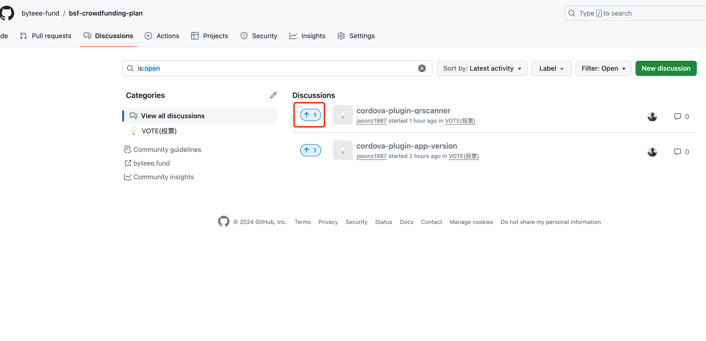
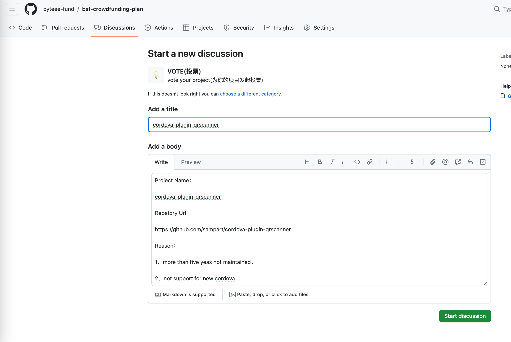

[中文](README_ZH.md)

# BSF Crowdfunding Plan

The BSF Crowdfunding Plan is an initiative launched by the [BSF Software Foundation](https://byteee.fund/) aimed at reviving and injecting new life into software projects, thereby promoting their sustainable development.

# Plan Process

The BSF Crowdfunding Plan follows the process below, with all stages being publicly disclosed:

Initiate Project -> Project Voting -> Project Crowdfunding -> Personnel Recruitment -> Project Development -> Project Launch -> Project Maintenance

# Suitable Projects

The main goal of the BSF Crowdfunding Plan is to rejuvenate old or quality projects, as well as to explore and innovate new projects. We welcome submissions of the following projects:

- Projects that have ceased updates or have been unmaintained for a long time;

- Projects that are scarcely or not at all present in the market;

- New platforms or ecosystems in need of empowerment;

- Projects involved in software copyright agreement disputes;

  

# Unsuitable Projects

The BSF Crowdfunding Plan avoids reinventing the wheel and unnecessarily wasting developers' efforts. Therefore, this plan may not be suitable for the following projects:

- Projects similar to existing ones that are still being updated;
- Projects for which complete alternative solutions exist;
- Projects that are too outdated to be compatible with current environments;
- Projects that do not comply with legal and regulatory requirements;

# How to Vote for Projects

*Note: Before submitting, please ensure to search and confirm whether someone else has already submitted the same project to avoid duplication.*

*If a similar project is found, simply click to vote.*

## How to Initiate a Project

Click on the [discussions](https://github.com/byteee-fund/bsf-crowdfunding-plan/discussions) page, enter the `vote` category, and then submit a new discussion.

Submission Template:

> **Project Name:**
>
> Example: cordova-plugin-wechat
>
> **Repository URL:**
>
> Example: https://github.com/xu-li/cordova-plugin-wechat
>
> **Reason for Application:**
>
> 1. The original project has ceased updates (or has not been updated for over a year);
> 2. The software's code can no longer be used on new platforms (or the software's code has serious functional issues);
>
> **Willingness to Crowdfund:**
>
> Yes

After submitting, it is recommended to stay subscribed for updates. If the project enters the crowdfunding stage or recruitment for maintainers begins, updates will be posted in the same discussion thread.

# Join Maintainer

If you want to be a maintainer for some projects, please leave your message on github or send mail to bsf@byteee.com
